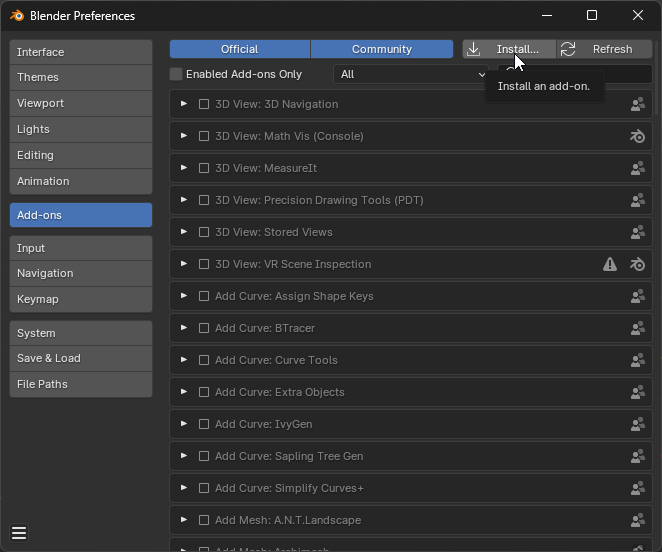

# 🧪 Misc Tools

## Save selected object(s) as unique list to file

<figure><figcaption></figcaption></figure>


It saves a list of the selected object(s) with unique entries to a text file generated on user's Desktop.

