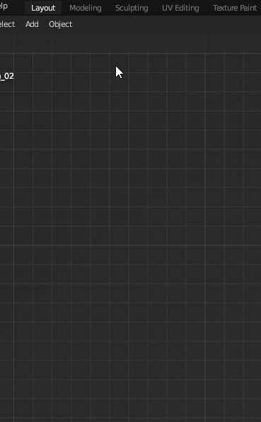
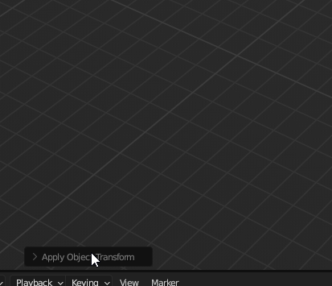
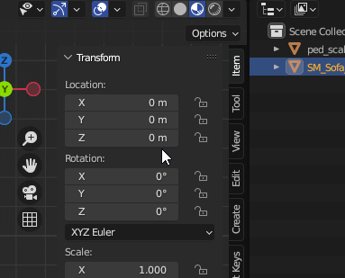
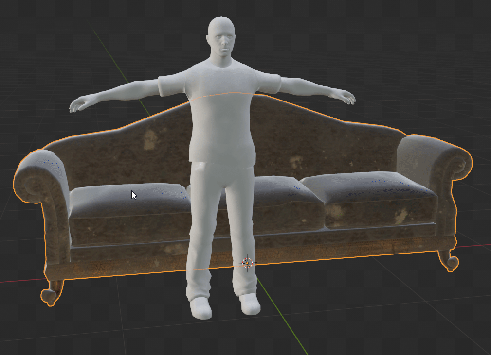
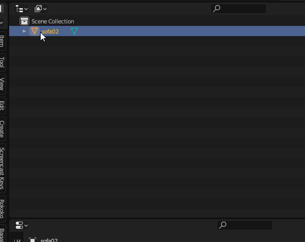
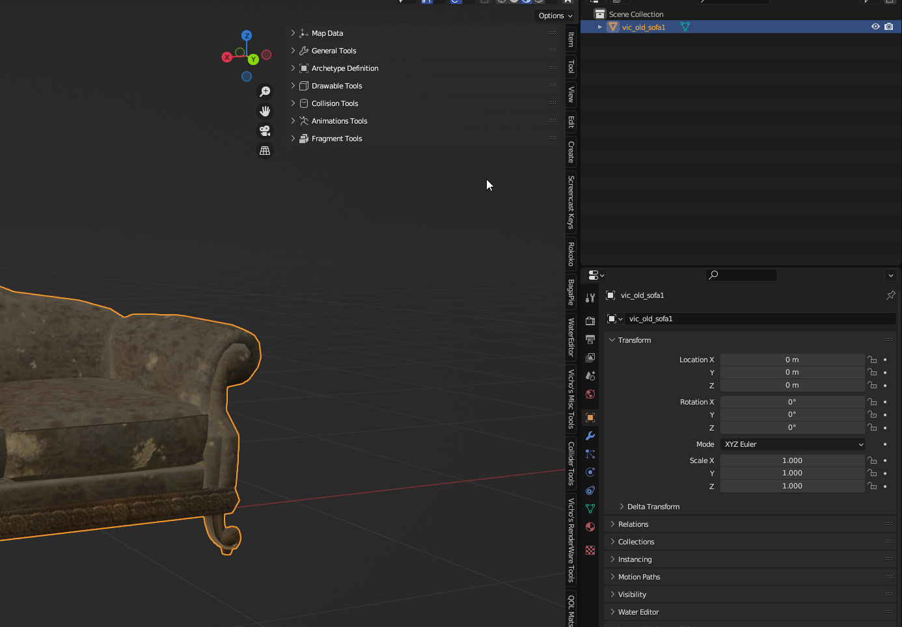
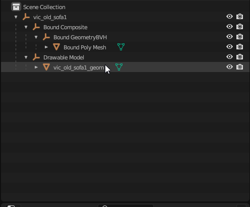
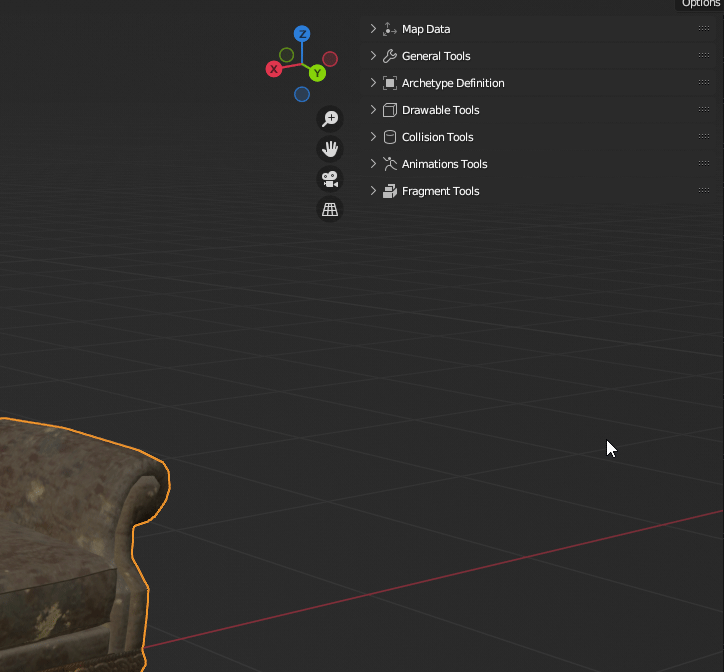
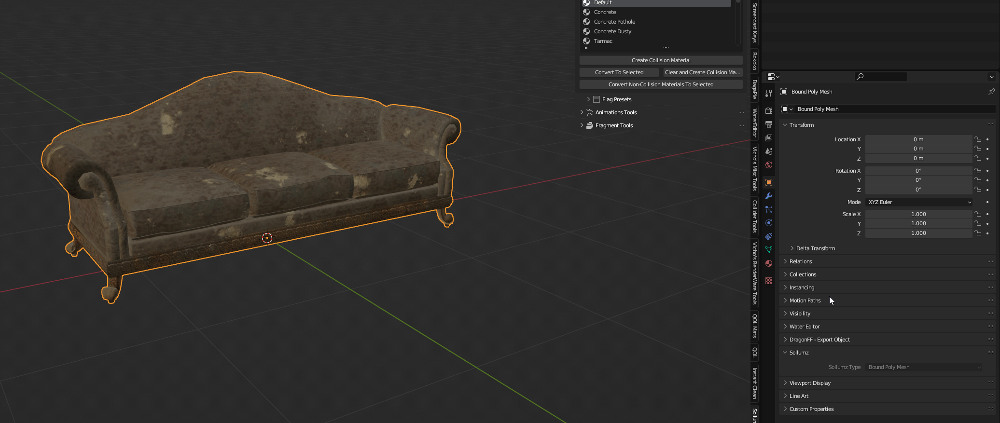

# 🔮 Basic Creation

#### For a better understand about the workflow and the formats check: [Sollumz Hierarchy](../../sollum-objects/) and [YDR](../../../gta-stuff/drawables/drawable-.ydr.md)


You must know Blender's basics before following this tutorial, go back to [..](../../../ "mention")to learn more.



You can create your own models, buy or download them from the Internet. As long you have a textured 3d model, you will be able to work with it.


For this example, I'll be using this Sofa model.

<figure><figcaption></figcaption></figure>

After downloading it, make sure the model's format is one of the supported formats by Blender.

#### The following are the most commonly used formats.

<table data-view="cards"><thead><tr><th></th><th align="center"></th><th></th></tr></thead><tbody><tr><td></td><td align="center">FBX</td><td></td></tr><tr><td></td><td align="center">OBJ</td><td></td></tr><tr><td></td><td align="center">DAE</td><td></td></tr><tr><td></td><td align="center">GLB/GLTF</td><td></td></tr></tbody></table>


It must come with textures,`PNG`and`TGA`formats are recommended.


## Importing and preparing the model

Now import the model and the reference model.


Use a scale reference model to match the game's scale, get a reference model from [here](https://cdn.discordapp.com/attachments/965904175672217640/1074571717428641792/ped\_scale.fbx).



If the model comes with textures but they aren't assigned upon importing, assign them by hand.


<figure><figcaption>
Sofas for giants is a reality among modern societies.
</figcaption></figure>

Do the needed transforms to get the correct scale, position and rotation.


Move with G, Scale with S and Rotate with R.


<figure><figcaption>
It's a fact that most people use sofas like this, right?
</figcaption></figure>

Now go to `Object` > `Apply` > `All Transforms`, this will reset all the scale, position and scale values to avoid any possible issue during exporting.

<figure><figcaption></figcaption></figure>

<figure><figcaption></figcaption></figure>


In case you know that your object's pivot location is right, just uncheck Location to keep it.



Since the prop will be placeable, it should have its origin at the lowest part but also centered, however, in this case the model I chose already had this type of origin.


In case you need to change the origin, do the following:

<figure><figcaption>
Hi mom!
</figcaption></figure>

&#x20;\
Now you will be able to move just the origin, to meet the lower part, you can help yourself using the snapping tools.


Remember to uncheck `Affect Only: Origins` once you finish positioning the origin to your liking.


## Materials

In most of cases you don't need to manually set materials, you can convert already materials from almost any mesh by pressing `V` > `Convert Material` or by pressing `Auto Convert` button Inside `Shader Tools` > `Tools`


Please note that in any given material that your object has, its `Color Node` node **MUST** be connected to an image texture since GTA and Sollumz can't use or convert colors.


<figure><figcaption>
OMG, WHERE DID THE SHINE GO?
</figcaption></figure>


Just if you haven't done it already, you can safely delete the ped reference model, we don't need it anymore.


Alternatively, you can create shader materials by clicking `Convert Active Material` in case you need a very specific shader other than: `default`, `normal`, `normal_spec` or `spec`

<figure><figcaption></figcaption></figure>


It is worth knowing that Shader Materials have some parameters that can be tweaked to get the desired look, but this will be covered in the future.


## Naming

Once we have setup all the materials as we want, we should give this Sofa a good name, please refer to [naming-conventions.md](../../../gta-stuff/naming-conventions.md "mention")to learn more.

<figure><figcaption></figcaption></figure>

## Drawable

Now it's time to turn this mesh into a usable GTA drawable.

Navigate to `Drawable Tools` > `Create Drawable Objects` > `Create Drawable Objects`


Since we are doing a prop, it needs collision, so you must check Auto-Embed collision.


<figure><figcaption></figcaption></figure>

## Collision Materials

Let's set some proper materials to our newly created collision.

In order to work easily, we should hide the drawable geometry, usually named with a `_geom` suffix

<figure><figcaption></figcaption></figure>

Select the `Bound Poly Mesh` object, if you are working with mutiple drawables at once, you will see a `.0xx` numeric suffix

Navigate to `Collision Tools` > `Create Collision Material`

<figure><figcaption></figcaption></figure>

Go to Material Properties, there you will find your material slots

<figure><figcaption></figcaption></figure>

Since each material is assigned to a set of faces, it is possible to select them by pressing Select while in edit mode, in this case the sofa is divided into two parts, wood and leather parts, this will make it really easy to assign the right material.

<figure><figcaption></figcaption></figure>


Do not count on this for all situations, there will be situations where you will have to manually select the geometry to correctly select the parts that will belong to a certain material. You can toggle X-Ray to help yourself to do a better selection of geometry if needed.



A good way to assign manually selected geometry to collision material is to create it using the **Create Collision Material** button while selecting the desired material within the Create **Collision Material** menu.

